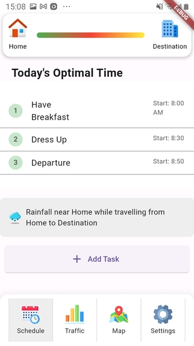
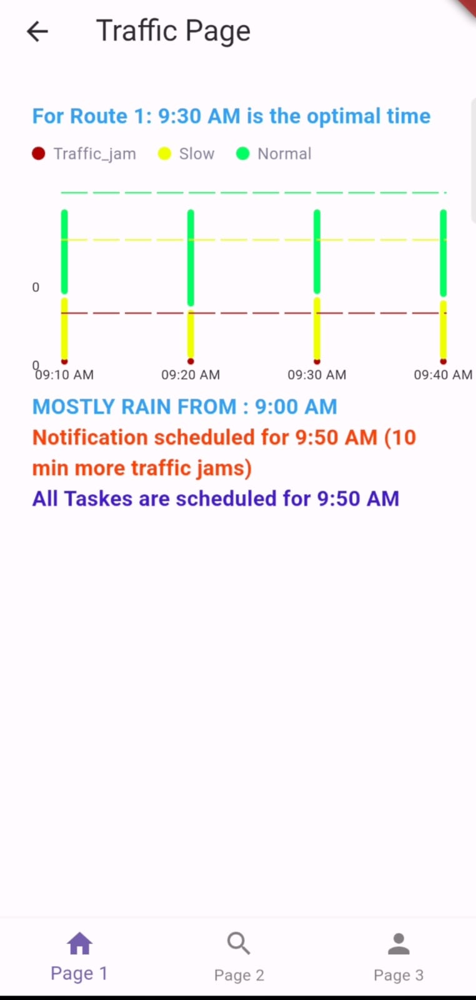
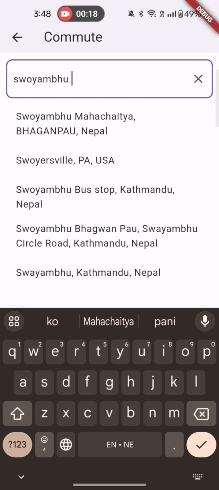
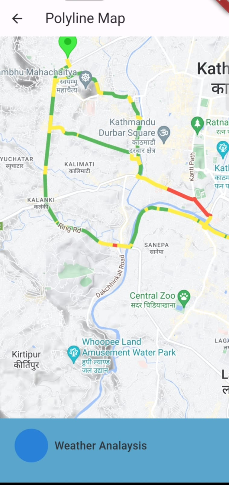
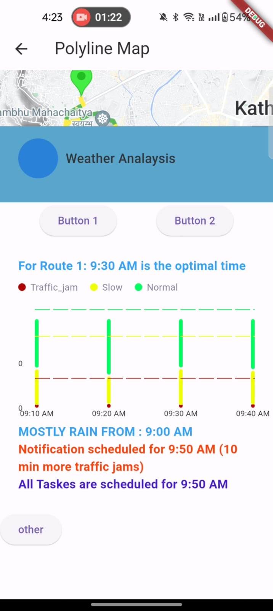
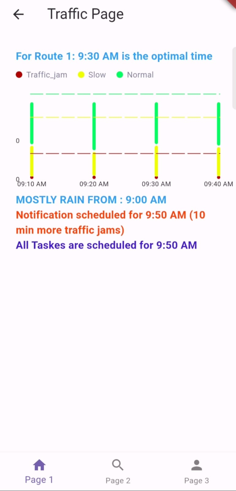
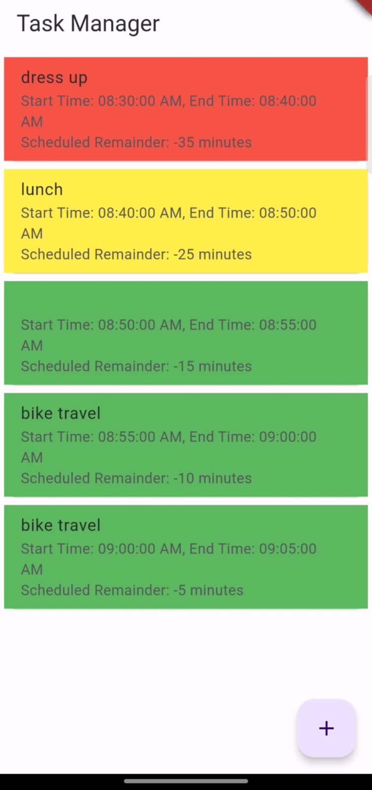
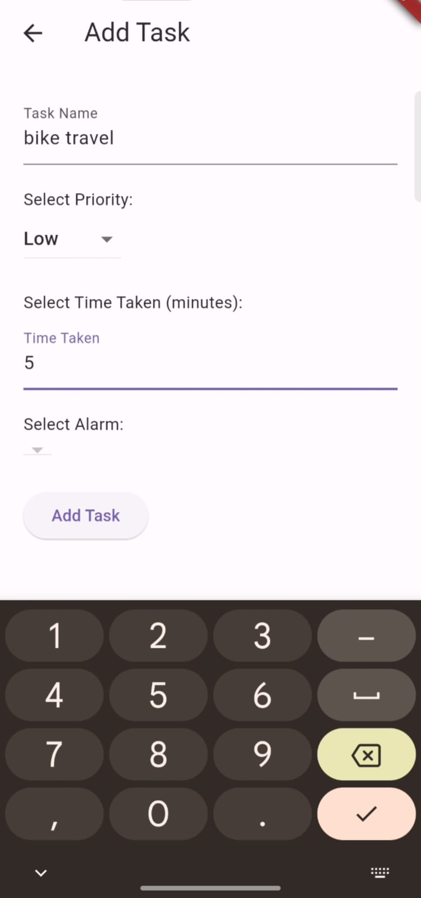

# Traffic Commute Assistant

    
    
    
    

    
    
    
    

## Inspiration

A friend of ours missed out on an incredible opportunity of bagging a profitable client for her company due to relentless traffic. This left her helpless, hopeless and since then the company resists handing over big projects to her. This incident served as a wake-up call, propelling us to develop a system for traffic assistance.

## What it does

Our system reschedules your daily schedule based on our traffic analysis of your daily commute. Our app provides customized service of analyzing real-time and predicted traffic conditions, suggesting alternative routes with less congestion, and even recommending adjustments to your departure time to ensure you arrive on time.

## How we built it

We built it by incorporating technologies like Flutter for cross-platform mobile app, Node JS for authentication, and Python for data analytics.

## Challenges we ran into

Delivering a promising prototype in limited time was a significant challenge during this hackathon. Beyond this, API integration & Data analysis were stimulating as well.

## Accomplishments that we're proud of

The pride factor is that we actually utilized our "own skills" to solve our "own problem" that we've practically faced. We are surprised how solving this traffic problem not only solves our problem but a large domain of people can benefit from it as well. We are happy that this hackathon provided us a platform where we were able to develop a system that assists and prevents us from getting trapped in hectic traffic congestion that we face on a daily basis.

## What we learned

We would have never known about the fine details and considerations that need to be addressed for solving traffic-related problems if we hadn't tried solving it. Only a solution might not be enough, it should be implemented in a systematic manner to foster factors like feasibility, market size, revenue, domain and so on. Besides that, we learned how vital teamwork is while working under pressure and time constraints. We also learned to be handy with new technologies and techniques.

## What's next for Traffic Commute Assistant

Our future advancements include:

- Real-time data and route-suggestion in case of uncertainty
- Multiple destination options in between the commute route
- Custom notification features for additional alerts
- Expand the reach of the application from the traffic domain and provide other

## Contributing

We welcome contributions from the community to improve Traffic Commute Assistant. If you have any suggestions, feature requests, or bug reports, please feel free to open an issue or submit a pull request. Your feedback and contributions will help make this project even better for everyone.

Feel free to reach out to any of our team members for questions or discussions:

- [Nirajan Bhattarai](https://github.com/Nirajan1-droid)
- [Giver Khadka](https://github.com/giver-kdk)
- [Sadhana Khadka](https://github.com/SadhanaKhadka)
- [Ayush Sharma](https://github.com/Ayushkkkkkkk)

Let's collaborate to build a better solution for traffic congestion!
## TILL NOW AND EXPECTED FEATURE UPDATES.
1.Already computed and predicted  data through the route api are considered till now for displaying the analysis.
The route api isn't perfect alone. so one feature we are seeking to imporve on:
Feature require: mapping the users offline gps coordinates, their intervals in roads, and mapping the delays after coming online to the polylines points got from the route-api.
            -> this data then will be used to predict the other days times on the road/commute with the route-api computed duration in roads.
            -> the accuracy of prediction can be further improved from various factors which we will discuss later on.
[For this feature understanding and contributon:[Nirajan Bhattarai](https://github.com/Nirajan1-droid)]

2.Before designing the new layouts, submit the flutter design to [Sadhana Khadka](https://github.com/SadhanaKhadka) for approval.
3.Ask [Giver Khadka](https://github.com/giver-kdk) for assistance in frontend part.
4.Ask  [Ayush Sharma](https://github.com/Ayushkkkkkkk) for data analysis and Autocomplete feature (Place API).
5. Task scheduling, Priority Sorting, Notification alerts feature are also not implemented fully.([For this feature understanding and contributon:[Nirajan Bhattarai](https://github.com/Nirajan1-droid)]) 

## License

This project is licensed under the [MIT License](LICENSE).
